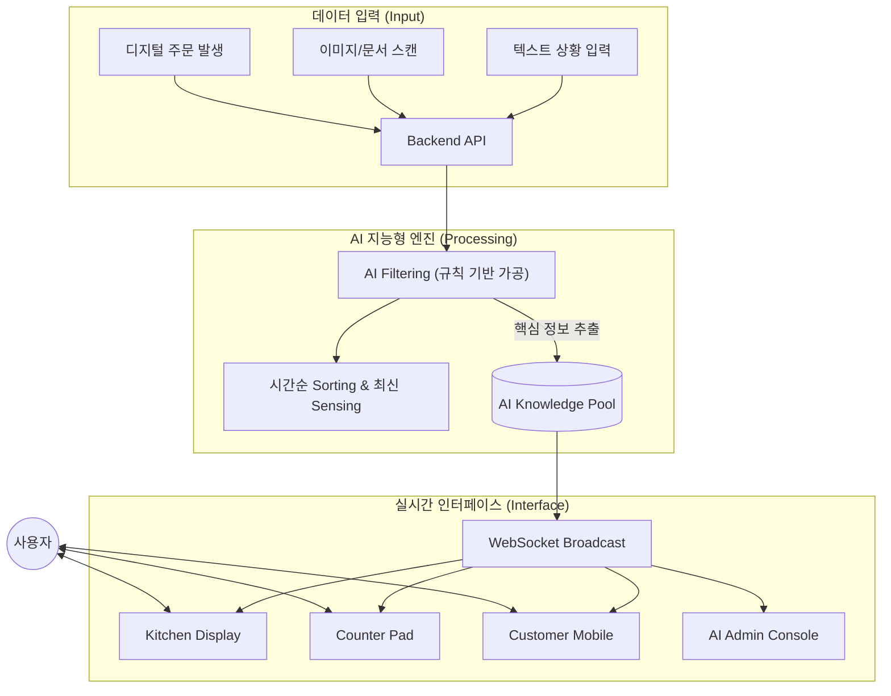

# 🏗️ AI 지식 관리 시스템 (Knowledge Management System) 아키텍처

본 문서는 **AI Knowledge Pool**에 저장된 데이터의 업데이트 흐름과, AI 필터링 규칙에 따라 데이터가 가공 및 표출되는 시스템 구조를 상세히 설명합니다.

---

## 1. 시스템 개념도 (System Overview)

---

## 2. AI Knowledge Pool (데이터 계층)

*   **No-Database 지향**: 고정된 스키마(Table)에 데이터를 맞추는 전통적인 방식이 아니라, 유연한 **JSON 객체(Bundle)** 단위로 정보를 저장합니다.
*   **데이터 포맷**: 
    *   **시간(Timestamp)**: 데이터가 발생한 정확한 시점 기록.
    *   **문장(Sentence)**: 상황의 맥락을 포함한 비정형 데이터.
    *   **구조**: `id, type, title, timestamp, items(name/value), status`

---

## 3. 데이터 가공 및 필터링 규칙 (AI Filtering Logic)

데이터가 업데이트되는 순간, AI 엔진은 다음 규칙에 따라 데이터를 정제합니다.

### ① 핵심 정보 필터링 (Core Extraction)
*   **노이즈 제거**: 입력된 문장 중 비즈니스 로직과 무관한 수식어나 불필요한 단어를 제거합니다.
*   **목표(Goal) 매칭**: 사전에 정의된 목표(`Orders`, `Settlement`, `Attendance`, `Log` 등) 중 가장 적합한 카테고리를 자동 분류합니다.
*   **필수 항목 추출**: 각 목표에 필요한 필수 항목(예: 메뉴, 테이블 번호, 가격 등)을 찾아내어 `items` 리스트로 변환합니다.

### ② 시간순 정렬 및 센싱 (Sorting & Sensing)
*   **LIFO (Last-In-First-Out)**: 가장 최신 데이터를 리스트의 최상단(Index 0)에 배치하여 즉각적인 인지가 가능하게 합니다.
*   **상태 감지(Sensing)**: 데이터의 유형에 따라 초기 상태(예: `cooking`, `ready`)를 부여하여 후속 프로세스를 트리거합니다.

---

## 4. 웹 페이지 인터페이스 구조 (Web Interface)

가공된 데이터는 다음과 같은 메커니즘을 통해 실시간으로 표출됩니다.

### ① 실시간 동기화 (WebSocket Broadcast)
*   지식 창고(Pool)에 변화가 생기는 즉시, 연결된 모든 웹 페이지(Web 1 ~ N)에 JSON 데이터를 브로드캐스트합니다.
*   사용자가 새로고침을 하지 않아도 화면이 즉각적으로 업데이트됩니다.

### ② 페이지별 최적화 표출
*   **주방(Kitchen)**: `status: 'cooking'`인 주문 데이터만 필터링하여 조리 리스트에 노출.
*   **카운터(Counter)**: 매장의 전체 흐름 및 `status: 'ready'`(조리 완료) 상태를 모니터링.
*   **고객(Customer)**: 자신의 주문 상태 및 결제 현황을 실시간 확인.

---

## 5. 시스템의 특징 및 장점

1.  **유연한 확장성**: 새로운 데이터 유형이 추가되어도 데이터베이스 구조 변경 없이 AI 필터링 규칙만 업데이트하면 즉시 대응 가능합니다.
2.  **현장 중심 설계**: "무엇을 입력했는가"보다 "현장에서 어떤 조치가 필요한가"에 집중하여 정보를 가공합니다.
3.  **코드리스(CodeLess) 지향**: 복잡한 프로그래밍 없이도 데이터의 흐름과 노출 규칙을 마크다운 설계서(`Matrix`) 기반으로 관리할 수 있습니다.

---

## 6. 타사 활용 사례 및 기술 비교

| 기업명 | 적용 분야 | 본 시스템과의 유사 원리 |
| :--- | :--- | :--- |
| **Amazon** | 실시간 추천 | 모든 활동을 '이벤트'로 처리하여 1초 이내 화면 업데이트 |
| **Stripe** | 이상 탐지 | AI가 결제 패턴을 실시간 센싱하여 부정 결제 즉시 차단 |
| **Palantir** | 객체 중심 모델링 | 파편화된 데이터를 하나의 '지식 객체(Object)'로 통합 관리 |
| **UPS** | 경로 최적화 | 실시간 지식 풀을 바탕으로 최적의 행동 지침을 현장에 전달 |

---

## 7. 시스템 고도화를 위한 제안 (Future Roadmap)

1.  **예측적 센싱 (Predictive)**: 과거 데이터를 기반으로 "1시간 뒤 재고 부족 예상" 등 미래 상황을 AI가 선제적으로 알림.
2.  **이상 탐지 가드레일**: "입차 기록은 있으나 3시간째 출차 없는 차량" 등 논리적 모순을 AI가 감지하여 보고.
3.  **지식 객체 간 인과관계 연결**: 근태 데이터와 주문 처리 속도를 연결하여 매장 운영 효율을 교차 분석.
4.  **자가 진화형 매트릭스**: AI가 운영 패턴을 분석하여 `Logic Matrix`의 규칙을 더 효율적으로 수정 제안.

---

## 8. 개발 도구: AI 시스템 설계 마스터 매트릭스

새로운 프로젝트 설계 시 아래 표를 가이드로 활용하십시오.

| 단계 (Flow) | 핵심 객체 (Bundle) | AI 필터링 규칙 | 웹 노출/사용자 액션 | 상태 전환 (Status) |
| :--- | :--- | :--- | :--- | :--- |
| **1. 생성** | 주인공 객체 정의 | 필수 추출 필드 설정 | 누가 보고 무엇을 입력하는가 | `Created` |
| **2. 진행** | 프로세스 추적 | 노이즈 제거/핵심 감지 | 작업 진행 상태 실시간 노출 | `Processing` |
| **3. 완료** | 결과 확정 | 완료 행동 감지 | 최종 결과물 및 알림 표출 | `Done / Ready` |
| **4. 정산/기록** | 가치 확정 | 금액, 수단, 결과 기록 | 정산 프로세스 및 영수증 확인 | `Paid / Success` |
| **5. 소멸** | 지식화/아카이빙 | 통계용 데이터 요약 | 통계 리포트 및 인사이트 생성 | `Archived` |

---
> [!TIP]
> 본 문서는 시스템의 확장과 변화에 따라 지속적으로 업데이트되는 **'살아있는 설계도'**입니다. 새로운 아이디어가 생길 때마다 매트릭스를 업데이트하여 지식의 밀도를 높여가십시오.
