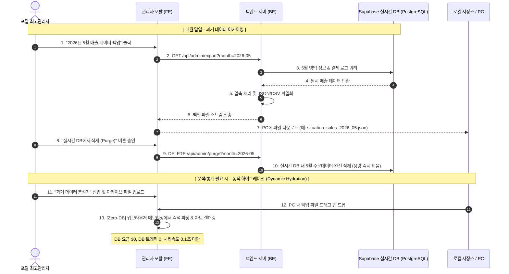

# 🗄️ Supabase 데이터 용량 최적화: 콜드 아카이빙 및 동적 하이드레이션 전략
> **Supabase Storage Optimization: Monthly Cold-Archiving & In-Browser Hydration Strategy**

본 문서는 **100여 개 가맹점** 규모로 포탈 서비스를 무리 없이 확장하는 과정에서 발생할 수 있는 Supabase 데이터베이스 용량 한계(무료 티어 500MB)를 극복하기 위한 무비용/초고효율 아카이빙 솔루션을 제안합니다.

---

## 1. 💡 핵심 아키텍처 컨셉: 라이브 DB 다이어트 & 브라우저 런타임 분석

가장 저렴한 데이터베이스 환경을 유지하면서 대용량 데이터를 다루는 핵심은 **"꼭 필요한 데이터만 DB에 남기고, 과거 통계는 파일로 분리한다"**는 철학입니다.

---

## 2. 🌟 세부 구현 전략 및 이점

### 1) 매월 말일 "원클릭 다운로드 & 실시간 DB 퍼지(Purge)"
*   **동작 방식**: 
    *   포탈 최고 관리자 페이지에 **`[월간 결제 데이터 관리]`** 섹션을 개설합니다.
    *   매월 말일이 지나면, 지난 달의 주문 목록(`orders`), 세션 정보(`sessions`), 포인트 변동 내역을 한데 묶어 **단일 `.json` 혹은 `.csv` 압축 파일**로 추출(Export)하여 로컬 컴퓨터에 안전하게 보관합니다.
    *   내보내기가 성공적으로 완료된 것을 확인한 뒤, **`[실시간 DB 최적화(삭제)]`** 버튼을 눌러 live DB에서 해당 기간의 대용량 로그를 삭제합니다.
*   **효과**: 실시간 데이터베이스는 언제나 **최근 1~2개월 내의 극히 컴팩트한 데이터(100MB 이하)만 유지**하므로, Supabase를 영원히 무료 티어 혹은 최소 비용으로 유지할 수 있습니다.

### 2) Zero-Database 인-브라우저 동적 통계 분석 (Client-Side Hydration)
일반적으로 "과거 통계를 보려면 DB에 다시 업로드해서 쿼리를 날려야 한다"고 생각하기 쉽지만, 이는 서버 리소스와 DB 요금을 발생시키는 비효율적인 방식입니다.
*   **혁신적인 대안 (In-Browser Parsing)**:
    *   통계가 필요할 때 백업해 둔 `.json` 파일을 포탈 분석창에 **드래그 앤 드롭(Drag & Drop)** 하기만 하면 됩니다.
    *   파일 업로드 시 **서버나 DB로 전송되는 것이 아니라**, 브라우저 내부 메모리(FileReader API 및 Web Workers)를 통해 **0.1초 만에 로컬에서 즉석 파싱**되어 고화질 차트(Chart.js, Recharts 등)로 그려집니다.
    *   **장점**:
        *   **비용 $0**: 데이터가 Supabase DB를 거치지 않으므로 데이터 전송료, 쿼리 연산료, 저장소 비용이 전혀 발생하지 않습니다.
        *   **보안성**: 손님의 개인정보나 매출 민감 정보가 인터넷 망을 타고 서버로 재전송되지 않으므로 최고의 보안을 자랑합니다.
        *   **극대화된 속도**: 네트워크 전송 딜레이 없이 PC 내부 램 메모리에서 분석하므로 수십만 건의 대량 데이터도 누르는 즉시 시각화됩니다.

---

## 3. 📊 용량 시뮬레이션 및 비용 예측 (100개 매장 기준)

| 항목 | 한 달 발생량 (매장당) | 100개 매장 한 달 총량 | DB 적재 시 (Supabase) | 로컬 압축 아카이브 아웃풋 (JSON) |
| :--- | :--- | :--- | :--- | :--- |
| **주문 내역 (Orders)** | 약 1,500건 | 150,000건 | 약 75 MB / 월 | **약 15 MB / 월** (gzip 시 3MB) |
| **세션 로그 (Sessions)**| 약 1,000건 | 100,000건 | 약 40 MB / 월 | **약 8 MB / 월** (gzip 시 1.5MB) |
| **포인트 로그** | 약 800건 | 80,000건 | 약 25 MB / 월 | **약 5 MB / 월** (gzip 시 1MB) |
| **총계** | **-** | **330,000건** | **약 140 MB / 월** | **약 28 MB / 월** (파일 1개로 저장) |

*   **아카이빙 미적용 시**: 4개월이 지나면 Supabase 무료 용량 한계(500MB)를 초과하여 매월 결제 모델로 강제 전환해야 함.
*   **아카이빙 적용 시**: 실시간 DB 용량을 상시 **50MB 이하**로 유지 가능. 평생 Supabase **기본 요금($0~최소 수준)**으로 가동 가능. 연간 100개 매장의 모든 누적 데이터(약 330MB)는 PC 외장하드나 무료 클라우드(Google Drive, Dropbox)에 분할 보관하여 영구 보존.

---

## 4. 🛠️ 로드맵 및 향후 구현 계획

1.  **Phase 1 (관리자 포탈 고도화)**:
    *   포탈 서비스 내 최고관리자용 매출 정보 파일 다운로드 기능 탑재.
2.  **Phase 2 (배치 자동화)**:
    *   매월 1일 새벽 4시, 서버단에서 전월 데이터를 자동으로 패킹하여 Supabase Storage 버킷(무료 1GB 제공)으로 자동 백업 이관 후 DB 자동 비우기 적용.
3.  **Phase 3 (Zero-DB 차트 엔진)**:
    *   백업받은 파일을 업로드하면 즉시 통계를 시각화해 주는 드래그 앤 드롭형 브라우저 전용 대시보드 인터페이스 개발.
