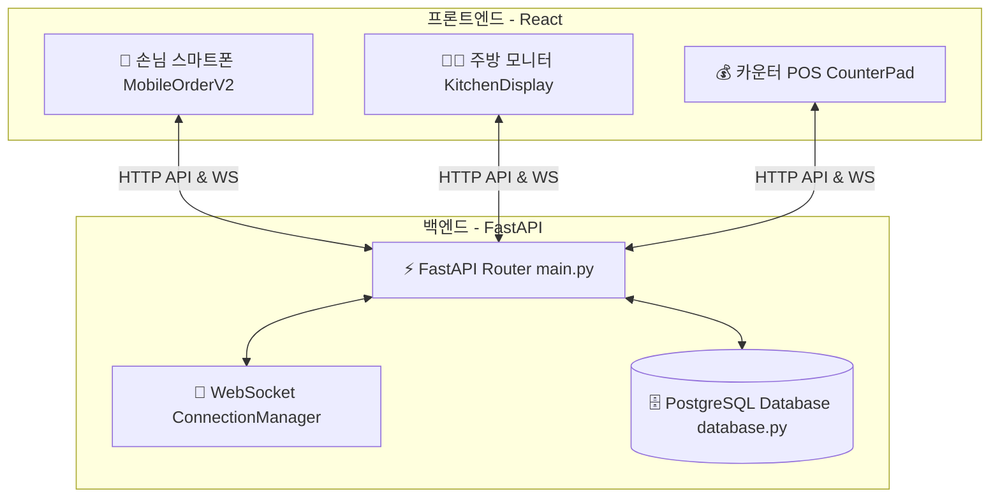
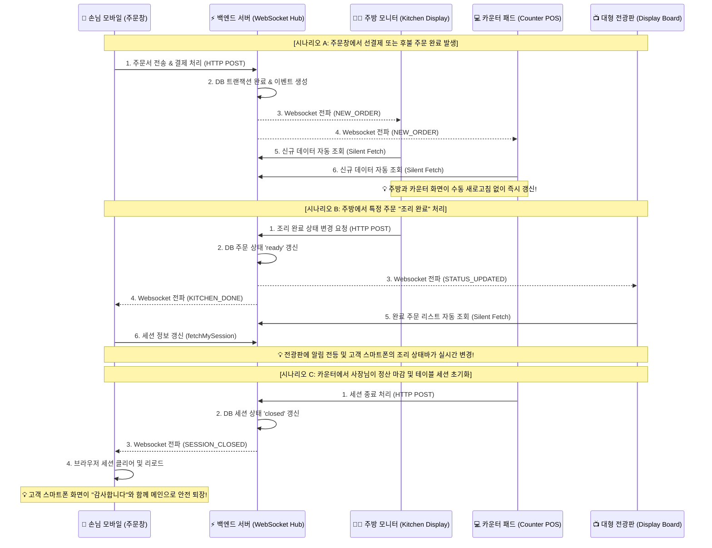
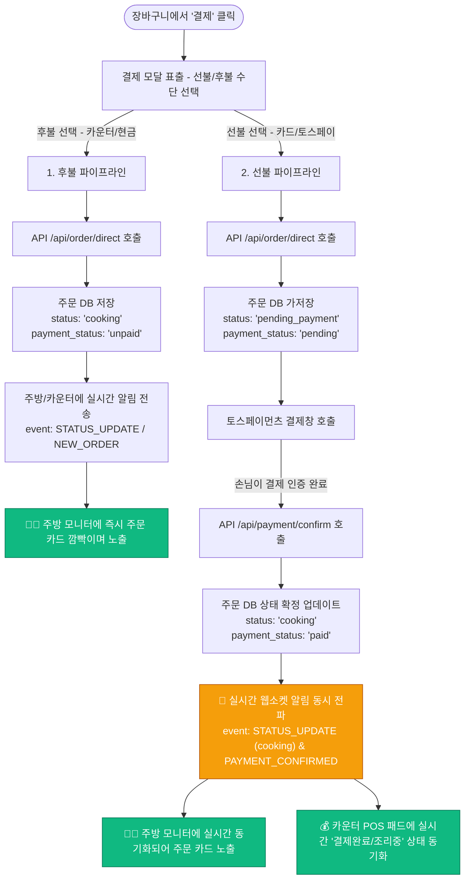
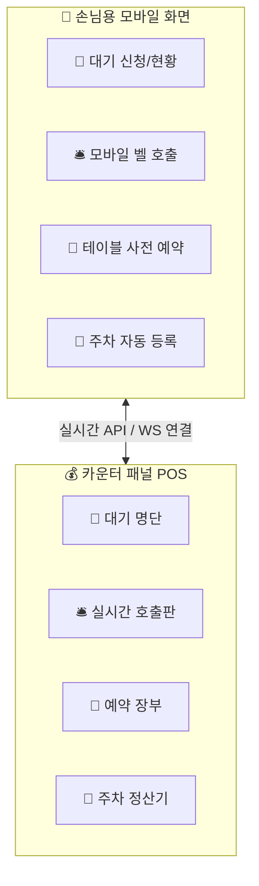
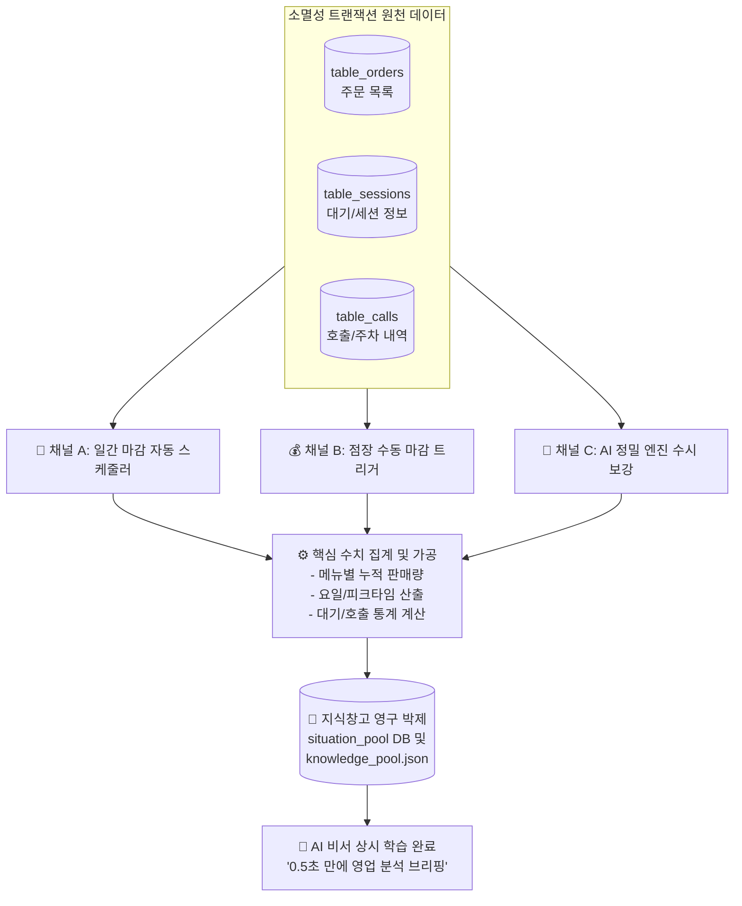
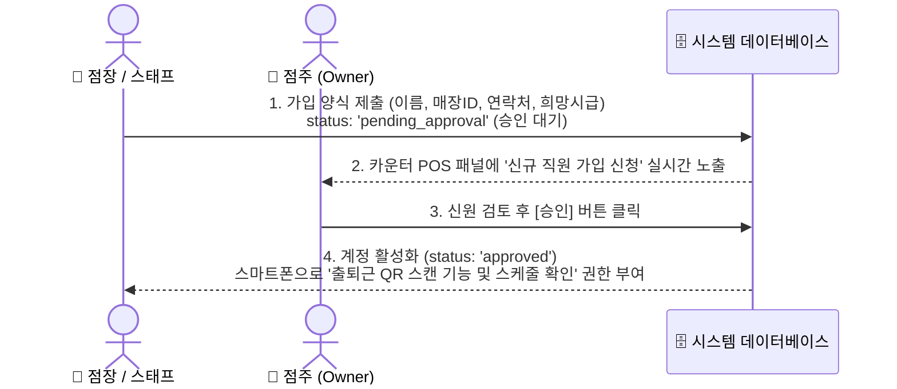

# 🗺️ 실시간 매장 주문/결제 시스템 정밀 설계 블루프린트 (System Blueprint)

> 사장님과의 개발 소통의 신뢰를 회복하고, 단 하나의 모듈을 수정할 때 기존의 기본 기능이 뿌리째 흔들리거나 누락되는 **퇴보(Regression) 문제를 완벽하게 방지하기 위한 정밀 시스템 도면**입니다. 이 도면은 사장님과 AI 모델 간의 **'양보할 수 없는 계약서(Single Source of Truth)'** 역할을 합니다.

---

## 1. 📂 전체 시스템 구성 요약 (Architecture Map)

본 시스템은 손님이 사용하는 스마트폰 화면, 주방 스태프 전용 모니터, 카운터 포스(POS) 패드가 실시간으로 상호작용하는 3원(Three-Way) 분산 실시간 시스템입니다.



---

## 2. 🔄 실시간 테이블 세션 라이프사이클 (Table Session Lifecycle)

하나의 테이블은 손님이 QR코드를 스캔하여 입장하는 순간부터 식사를 완전히 마치고 테이블을 비우는 순간까지 명확한 생명 주기(Session State)를 가집니다.

```mermaid
stateDiagram-v2
    [*] --> Pending : 1. QR 스캔 입장 요청 (/api/checkin/request)
    
    state "Pending (대기 상태)" as Pending
    note right of Pending
        손님 화면: "스마트 오더 연결 중 (좌석 대기)" 노출
        카운터 화면: '세션 개시 승인' 버튼 활성화
    end
    
    Pending --> Active : 2. 점장이 카운터에서 개시 승인 (/api/session/open)
    Pending --> Closed : (예외) 점장이 거절 또는 초기화
    
    state "Active (식사/주문 중)" as Active
    note right of Active
        손님 화면: 실시간 메뉴판 활성화, 수시 주문 가능
        카운터 화면: 실시간 주문 차수 및 합산 금액 표시
    end
    
    Active --> Active : 3. 차수별 추가 주문 발생 (선불/후불)
    Active --> Closed : 4. 최종 정산 완료 및 테이블 비우기 (/api/session/close)
    Active --> Closed : (강제) 테이블 강제 리셋/주문취소 (/api/session/reset)
    
    state "Closed (세션 종료)" as Closed
    note right of Closed
        테이블 소등, 손님 화면 초기화 및 세션 메모리 소멸
    end
    
    Closed --> [*]
```

---

## 3. 📦 핵심 데이터 객체 구조 정의 (Session & Order Object Schemas)

시스템 전체에서 테이블의 라이프사이클을 조율하는 **세션(Session) 객체**와 개별 식사 단계를 구성하는 **주문(Order) 객체**의 필드 세부 구조 및 의미 정의입니다.

### 🪑 3-1. 테이블 세션 객체 (Session Object)
* **목적:** 테이블 고유의 손님 점유를 관리합니다. 손님이 QR을 스캔해서 식사를 마칠 때까지 단 하나만 생성되는 '부모(Parent)' 객체입니다.
* **특징:** 내부에 자식 주문서들을 시간 순서대로 담는 실시간 `orders[]` 배열을 보유하여, 중복되고 불필요한 메타데이터 필드를 배제합니다.
* **데이터베이스 테이블명:** `table_sessions`

| 필드명 (Key) | 데이터 타입 | 설명 (Description) | 상태/값 예시 (Value Example) |
| :--- | :--- | :--- | :--- |
| `session_id` | `TEXT (PK)` | 세션 고유 식별 키 (SESS- 접두사 + 8자리 난수) | `"SESS-4F2A1E9B"` |
| `store_id` | `TEXT` | 매장 식별자 코드 (기본값: 'default_store') | `"default_store"`, `"BND-STORE01"` |
| `table_id` | `TEXT` | 점포 내 테이블 고유 번호 | `"T03"` (3번 테이블), `"T12"` |
| `status` | `TEXT` | 현재 세션의 상태 (Pending: 대기, Active: 주문활성, Closed: 소멸) | `"active"`, `"pending"`, `"closed"` |
| `orders` | `ARRAY [Order]` | **이 세션에 누적 발생한 차수별 주문 객체 리스트 (배열)** | `[Order_1, Order_2, ...]` (상세 구조 하단 참조) |
| `metadata` | `JSONB` | 향후 비즈니스 확장을 위한 임시 유동 데이터 저장 공간 | `{"party_size": 4}` |

---

### 📝 3-2. 주문 객체 (Order Object)
* **목적:** 손님이 수시로 추가 주문하는 음식 목록 및 금액, 결제 여부를 기록합니다. 하나의 세션 하위에 차수별로 무한히 생성될 수 있는 '자식(Child)' 객체입니다.
* **데이터베이스 테이블명:** `table_orders`

| 필드명 (Key) | 데이터 타입 | 설명 (Description) | 상태/값 예시 (Value Example) |
| :--- | :--- | :--- | :--- |
| `order_id` | `TEXT (PK)` | 개별 주문서 고유 식별 키 (ORD- 접두사 + 8자리 난수) | `"ORD-A7D1C3B4"` |
| `session_id` | `TEXT (FK)` | 이 주문이 귀속된 부모 세션 고유 식별 키 (1:N 맵핑용) | `"SESS-4F2A1E9B"` |
| `store_id` | `TEXT` | 매장 식별자 코드 | `"default_store"` |
| `table_id` | `TEXT` | 음식을 제공할 목적지 테이블 번호 | `"T03"` |
| `device_id` | `TEXT` | 이 특정 차수 주문을 **실제로 장바구니에 담아 전송한 개별 구성원**의 기기 ID | `"DEV-FRIEND222"` |
| `items` | `JSONB` | 주문된 음식 리스트 (품명, 가격, 수량 포함 배열) | `[{"name": "파스타", "price": 15000, "quantity": 2, "qty": 2}]` |
| `total_price` | `INTEGER` | 이 차수 주문서의 최종 합산 요금 (포인트 사용분 차감액) | `30000` |
| `status` | `TEXT` | **주문 진행 단계** (주문 $\rightarrow$ 조리 $\rightarrow$ 서빙 $\rightarrow$ 결제 $\rightarrow$ 취소) | `"cooking"`, `"served"`, `"paid"`, `"cancelled"` |
| `payment_status`| `TEXT` | **결제 대분류** (선결제: 고객 폰 직접 결제 / 후결제: 카운터 점장 승인) | `"prepaid"`, `"unpaid"`, `"paid"` |
| `payment_method`| `TEXT` | 사용된 상세 결제 수단 종류 (카드, 이체 QR, 현금 등) | `"카드"`, `"카운터"`, `"TossPay"` |
| `timestamp` | `TEXT` | 주문서가 DB에 최초 생성된 ISO 시간 | `"2026-05-08T21:05:32.124Z"` |

---

### 🔄 3-3. 관계형 DB 분리와 런타임 메모리 객체 결합 (Relational DB vs Runtime Memory Object)

사장님의 탁월하고 날카로운 엔지니어링 직관대로, **데이터의 중복을 배제하고 단순 명료하게 설계(DRY 원칙 - Don't Repeat Yourself)하는 최고 수준의 시스템 기획**을 전격 도입하여 객체 정의를 획기적으로 개선했습니다.

1. **중복되고 무의미한 속성의 완벽한 소거**
   * **차수(`order_seq`) 컬럼 제거:** 세션(`Session`) 객체가 내부에 시간 순서대로 차곡차곡 들어오는 자식 주문들을 `orders[]` 리스트 배열로 관리하고 있으므로, 굳이 개별 주문(`Order`)에 정수형 차수 번호를 중복 저장할 필요가 전혀 없습니다. **리스트 내에서의 순서(Index 위치) 즉, `orders[0]`은 자연스레 1차 주문이 되고 `orders[1]`은 2차 주문**이 되어 암묵적으로 차수가 결정되기 때문입니다.
   * **세션 방장 기기 ID(`session.device_id`) 컬럼 제거:** 세션 자체에서 방장 기기 ID를 독립 컬럼으로 관리할 필요가 없습니다. 세션에 담긴 첫 번째 주문(`session.orders[0].device_id`)의 기기 ID가 바로 이 세션을 열고 최초 주문을 넣은 주 손님의 기기 ID이기 때문입니다. 
   * **체크인/체크아웃 시간(`checkin_time`, `checkout_time`)의 제거:** 세션 객체 자체에 입장 시간과 퇴장 시간을 따로 중복 관리할 필요가 없습니다. 세션의 첫 번째 주문 시간인 `orders[0].timestamp`가 곧 손님의 **최초 체크인/주문 시간**이 되며, 세션의 마지막 주문이 최종 결제 완료되어 닫히는 시점의 `timestamp`가 곧 **체크아웃 시간**으로 자동 유추 및 완벽하게 성립될 수 있기 때문입니다.
   * **기기 동일성 및 동행인 간편 식별:** 추가 주문이 발생할 때마다, 들어오는 신규 주문의 `device_id`와 기존에 `orders[]` 리스트에 누적되어 있던 주문들의 `device_id`를 상호 대조하는 것만으로 동일 기기의 주문인지, 동행 일행의 주문인지 아주 가볍게 판별해 낼 수 있습니다.

2. **결합 데이터 JSON 예시:**

```json
{
  "session_id": "SESS-4F2A1E9B",
  "store_id": "default_store",
  "table_id": "T03",
  "status": "active",
  "metadata": {},
  "orders": [ // <-- 시간 순서대로 쌓이는 배열 리스트
    {
      "order_id": "ORD-11111111",
      "session_id": "SESS-4F2A1E9B",
      "device_id": "DEV-LEADER111", // 최초 체크인 기기(방장) = orders[0].device_id
      "items": [{"name": "안심 스테이크", "price": 45000, "quantity": 1}],
      "total_price": 45000,
      "status": "served",
      "payment_status": "unpaid",
      "timestamp": "2026-05-08T21:05:00.000Z" // 최초 체크인 및 1차 주문 시간 = orders[0].timestamp
    },
    {
      "order_id": "ORD-22222222",
      "session_id": "SESS-4F2A1E9B",
      "device_id": "DEV-FRIEND222", // 동행 일행의 추가 주문 판별
      "items": [{"name": "콜라", "price": 3000, "quantity": 2}],
      "total_price": 6000,
      "status": "cooking",
      "payment_status": "unpaid",
      "timestamp": "2026-05-08T21:20:00.000Z" // 추가 2차 주문 시간
    }
  ]
}
```

---

### 📡 3-4. ⚡ 초고속 실시간 매장 전역 동시성 동기화 아키텍처 (Cross-Terminal Real-Time Event Sync)

본 플랫폼은 주문 창(모바일 고객), 주방 모니터(KDS), 카운터 POS 패널, 대형 전광판(Display Board) 등 **매장 내의 서로 다른 다중 웹 페이지들이 실시간으로 완벽하게 상호작용하며 통신하는 분산형 동기화 구조**를 지니고 있습니다. 손님이 폰으로 주문을 넣거나 주방장이 완료 버튼을 클릭하는 등의 행동이 발생하는 즉시, 전 기기에 0.1초 이내로 실시간 반영됩니다.

#### 1. 🌟 시스템 핵심 특징 (Key System Characteristics)
* **단일 연결 원칙 (Single Connection Protocol):** 각 클라이언트 페이지는 브라우저 기동 시 백엔드의 WebSocket 채널(`ws/kitchen` 또는 `ws/table/{table_id}`)로 단 하나의 커넥션만 유지합니다. 이를 통해 서버 부하를 무결하게 억제하면서 초고속 수납 채널을 보장합니다.
* **이벤트 소싱 기반 경량 알림 (Lightweight Event Sourcing):** 무겁고 변조의 여지가 있는 가공되지 않은 통 데이터 전체를 웹소켓으로 직접 퍼 나르지 않습니다. 대신 백엔드는 `"NEW_ORDER"`, `"STATUS_UPDATED"`, `"PAYMENT_APPROVED"`와 같은 **초경량 표준 액션 이벤트 시그널**만을 순간적으로 멀티캐스트(Multicast)합니다.
* **사일런트 풀링 동기화 (Silent Pull-Sync Architecture):** 액션 시그널을 수신한 클라이언트 페이지는 해당 신호의 종류에 알맞은 API를 배경에서 자동으로 정밀 호출(Silent Fetch)하여 수렴 데이터를 조회합니다. 데이터 유실 및 메모리 상태 정합성 오염을 100% 차단하며, 최상의 렌더링 성능과 무결한 영구 상태 정합성을 동시에 달성합니다.
* **다중 가상 매장 논리 격리 (Multi-Tenant Logic Isolation):** 통합 소켓 허브(`ws/kitchen`)를 이용함에도 불구하고, 수신된 소켓 프레임에 담긴 `store_id`를 각 브라우저가 본인의 활성 `store_id`와 대조하여 필터링하므로 여러 가맹 매장이 동시 접속하더라도 데이터 혼선이 완벽히 예방됩니다.

---

#### 2. 🔌 실시간 통신 흐름 상세도 (Event Broadcasting Pipeline)



---

#### 3. 📝 실시간 공유 이벤트 규격 명세 (Real-Time Event Schemas)

시스템 내에서 공유 및 멀티캐스팅되는 대표적인 실시간 이벤트 종류 및 프레임 구조입니다.

| 이벤트명 (Type) | 송신 주체 | 수신 대상 | 주요 동작 및 영향 |
| :--- | :--- | :--- | :--- |
| `NEW_ORDER` | 주문창 (모바일) | 주방, 카운터 | 주방 화면에 주문서 카드 추가, 대기 중 주문 카운트 실시간 증가 |
| `PAYMENT_APPROVED` | 외부 결제 대행 (Toss) | 주문창, 카운터 | 결제 대기 상태가 해제되며 주방으로 정상 주문 발송 처리 |
| `STATUS_UPDATED` | 주방 (조리 완료) | 전광판, 주문창 | 대형 전광판에 호출 번호 자동 점등, 고객폰 알림 활성화 |
| `STAFF_CALL` | 주문창 (호출 버튼) | 카운터 | 카운터 화면 하단의 직원 호출 탭에 알림 깜빡임 점멸 가동 |
| `SESSION_OPENED` | 카운터 (점장 승인) | 주문창 (모바일) | QR 스캔 대기 화면에서 실시간 메뉴판 화면으로 페이지 즉시 자동 전환 |
| `SESSION_CLOSED` | 카운터 (정산/퇴장) | 주문창 (모바일) | 식사가 끝난 고객의 주문 페이지를 영구 정지하고 홈으로 내보냄 |
| `WAITING_REGISTERED`| 웨이팅 패드 (입구) | 카운터 | 실시간 웨이팅 탭에 신규 고객 대기 신청을 자동 갱신 및 경보 |

---

## 4. 💳 주문 생성 및 선불/후불 결제 정밀 흐름도 (Order & Payment Flow)

손님이 장바구니에 담은 음식이 실제 주방에 전달되어 조리가 시작되기까지의 분기 처리 흐름입니다.



---

## 5. 🛎️ 통합 고객 편의 서비스 모듈 (Unified Customer Service Modules)

매장에서 손님과 직원 간의 불필요한 동선을 최소화하고, 최상의 매장 만족도를 달성하기 위해 결합된 4대 핵심 고객 편의 서비스(대기, 호출, 예약, 주차)의 통합 구조도 및 명세서입니다.



---

### 🚶 5-1. 스마트 대기 관리 (Waiting & Queue Management)
* **목적:** 만석 시 손님이 가게 앞에서 줄서지 않고, 모바일/키오스크로 간편하게 번호표를 뽑아 카운터와 실시간 소통하도록 관리합니다.
* **데이터베이스 테이블명:** `table_waitings`
* **핵심 흐름:**
  1. **접수:** 손님이 인원, 전화번호 입력 $\rightarrow$ `/api/waiting/register` $\rightarrow$ 상태: `waiting` (대기 중)
  2. **알림:** 카운터 패드에 실시간 알림음 및 대기 인원 깜빡임 노출.
  3. **호출:** 점장이 카운터에서 [대기 호출] 클릭 $\rightarrow$ 대기 번호 입장 알림 발송 및 상태: `called` (호출됨)
  4. **입장:** 손님 도착 시 세션 개시 및 입장 완료 처리 $\rightarrow$ 상태: `entered` (입장 완료)

| 필드명 (Key) | 데이터 타입 | 설명 (Description) | 상태/값 예시 (Value Example) |
| :--- | :--- | :--- | :--- |
| `waiting_id` | `TEXT (PK)` | 대기 번호 고유 식별자 (WAIT-접두사 + 난수) | `"WAIT-9X82"` |
| `phone_number`| `TEXT` | 손님의 연락처 (입장 호출 알림 발송용) | `"010-1234-5678"` |
| `party_size` | `INTEGER` | 방문 손님 인원수 | `4` (4명) |
| `status` | `TEXT` | 대기 상태 단계 (`waiting`: 대기, `called`: 호출, `entered`: 입장, `cancelled`: 취소) | `"waiting"`, `"called"`, `"entered"` |
| `timestamp` | `TEXT` | 대기 번호표를 뽑아 신청한 ISO 시점 | `"2026-05-08T18:30:22.000Z"` |

---

### 🛎️ 5-2. 스마트 직원 호출 (Staff Calling / Paging)
* **목적:** "물 좀 주세요", "반찬 더 주세요", "직원 좀 불러주세요" 등의 용건을 직원을 직접 부르거나 소리 지르지 않고 탭/폰 클릭 한 번으로 정확하게 전송합니다.
* **데이터베이스 테이블명:** `table_calls`
* **핵심 흐름:**
  1. **신청:** 손님이 스마트폰에서 [물 가져다주기] 클릭 $\rightarrow$ `/api/call` 호출 $\rightarrow$ 상태: `pending` (대기 중)
  2. **알림:** 카운터 POS 패드에 "T03번 테이블: 물 배달" 알림 팝업 및 청각적 알림 출력.
  3. **완료:** 직원이 해당 물품을 가져다주고 카운터에서 [해결 완료] 클릭 $\rightarrow$ 상태: `resolved` (완료)

| 필드명 (Key) | 데이터 타입 | 설명 (Description) | 상태/값 예시 (Value Example) |
| :--- | :--- | :--- | :--- |
| `call_id` | `TEXT (PK)` | 개별 호출 건 고유 식별 코드 | `"CALL-A1B2"` |
| `table_id` | `TEXT` | 호출을 발생시킨 테이블 번호 | `"T03"` |
| `session_id` | `TEXT` | 현재 식사 중인 고유 세션 키 | `"SESS-4F2A1E9B"` |
| `call_type` | `TEXT` | 상세 호출 용건 (물, 물티슈, 직원 호출 등) | `"물 가져다주기"`, `"물티슈"`, `"직원호출"` |
| `status` | `TEXT` | 호출 처리 여부 (`pending`: 대기중, `resolved`: 완료) | `"pending"`, `"resolved"` |
| `timestamp` | `TEXT` | 손님이 호출 벨을 클릭한 ISO 시점 | `"2026-05-08T21:15:30.000Z"` |

---

### 📆 5-3. 실시간 사전 예약 (Reservation System)
* **목적:** 방문 전 날짜, 시간, 인원수를 지정하여 예약을 신청하고, 점장이 카운터에서 실시간으로 이를 컨펌하여 특정 테이블에 자동 배정되도록 합니다.
* **데이터베이스 테이블명:** `table_reservations`
* **핵심 흐름:**
  1. **신청:** 손님이 모바일/웹으로 날짜, 시간, 테이블 배정 희망 건 신청 $\rightarrow$ 상태: `requested` (승인 대기)
  2. **승인:** 점장 확인 후 카운터에서 [승인 완료] 클릭 $\rightarrow$ 상태: `confirmed` (예약 확정)
  3. **연동:** 예약 당일 시간 10분 전이 되면, 지정 테이블(`table_id`)이 카운터 패드에 "예약석(Reserved)"으로 노출 및 소등 처리.
  4. **착석:** 예약 손님 방문 시 [착석 완료] 처리 $\rightarrow$ 상태: `seated` (착석 완료) 및 신규 테이블 세션 자동 개시.

| 필드명 (Key) | 데이터 타입 | 설명 (Description) | 상태/값 예시 (Value Example) |
| :--- | :--- | :--- | :--- |
| `reservation_id` | `TEXT (PK)` | 예약 고유 번호 | `"RESV-3329"` |
| `customer_name`  | `TEXT` | 예약자 명 | `"홍길동"` |
| `phone_number`   | `TEXT` | 예약자 연락처 | `"010-9999-8888"` |
| `party_size`     | `INTEGER` | 예약 인원수 | `6` (6명 단체) |
| `reserved_time`  | `TEXT` | 예약 희망 날짜 및 시간 | `"2026-05-10T19:00:00.000Z"` |
| `table_id`       | `TEXT` | 배정될 예약 고유 테이블 번호 | `"T03"` |
| `status`         | `TEXT` | 예약 상태 (`requested`: 대기, `confirmed`: 확정, `seated`: 착석, `cancelled`: 취소) | `"confirmed"`, `"seated"` |

---

### 🚗 5-4. 원클릭 셀프 주차 할인 (Parking Management)
* **목적:** 카운터에서 나갈 때 번거롭게 직원에게 차 번호를 불러줄 필요 없이, 식사하는 도중에 손님이 스마트폰에서 직접 본인의 차량 번호 뒤 4자리를 조회해 무료 주차 시간 할인을 셀프로 적용받습니다.
* **데이터베이스 테이블명:** `table_parkings`
* **핵심 흐름:**
  1. **입력:** 손님이 식사 도중/결제 전에 스마트폰 화면에서 차량 번호 뒤 4자리(예: `1234`)를 검색 및 선택.
  2. **연동:** 백엔드가 주차 관제 시스템 API(예: 아마노코리아, 나이스파크 등)에 연동 요청 $\rightarrow$ 2시간 무료 자동 승인 신청.
  3. **승인:** 주차 관제 결과 수신 및 적용 상태 업데이트 $\rightarrow$ 상태: `applied` (적용 완료)
  4. **표시:** 손님 영수증 하단에 "무료 주차 2시간 등록 완료" 문구 표출.

| 필드명 (Key) | 데이터 타입 | 설명 (Description) | 상태/값 예시 (Value Example) |
| :--- | :--- | :--- | :--- |
| `parking_id` | `TEXT (PK)` | 주차 등록 고유 코드 | `"PARK-4029"` |
| `session_id` | `TEXT` | 소속된 테이블의 식사 고유 세션 번호 | `"SESS-4F2A1E9B"` |
| `vehicle_number`| `TEXT` | 정산 대상 차량 전체 번호 | `"서울34가1234"` |
| `discount_minutes`| `INTEGER`| 부여받은 무료 주차 혜택 시간 | `120` (120분 무료 주차 적용) |
| `status` | `TEXT` | 관제 연동 적용 결과 (`applied`: 완료, `failed`: 실패) | `"applied"`, `"failed"` |
| `timestamp` | `TEXT` | 주차 셀프 등록 신청 승인이 완료된 ISO 시간 | `"2026-05-08T22:10:00.000Z"` |

---

## 6. 🎛️ 실시간 웹소켓 동기화 매트릭스 (Real-time WS Event Matrix)

어느 단말기에서 이벤트가 발생하든 즉각적으로 다른 단말기들이 0.1초 만에 최신 정보를 갱신하도록 구성하는 백엔드 전파 계약서입니다.

| 전송 주체 (Sender) | 유발 동작 (Action) | 웹소켓 이벤트명 (`type`) | 데이터 페이로드 (`payload`) | 수신 주체 및 반응 (Receiver Action) |
| :--- | :--- | :--- | :--- | :--- |
| **백엔드 (API)** | 새로운 손님 QR 스캔 대기 | `JOIN_REQUEST` | `table_id`, `device_id` | **카운터 & 기존손님:** 신규 기기 합류 승인 팝업 노출 |
| **백엔드 (API)** | 세션 승인 / 수동 개시 | `SESSION_OPENED` | `session` (상태: `active`) | **손님 스마트폰:** 대기 화면 해제 및 메뉴판 즉시 활성화 |
| **백엔드 (API)** | 테이블 정산 완료 및 퇴실 | `SESSION_CLOSED` | `session_id` | **손님 스마트폰:** 첫 로딩 화면으로 복귀 (세션 초기화) |
| **백엔드 (API)** | 신규 후불 주문 등록 | `NEW_ORDER` | `order` (상태: `cooking`) | **주방 모니터 & 카운터:** 화면 리로드 및 신규 알림음 출력 |
| **백엔드 (API)** | 선불 결제 승인 성공 | `STATUS_UPDATE` | `order_id`, `status: 'cooking'` | **주방 모니터 & 카운터:** '결제완료/조리대기' 리스트에 주문 카드 자동 추가 |
| **주방 (Monitor)**| 셰프의 [조리 완료] 클릭 | `STATUS_UPDATE` | `order_id`, `status: 'ready'` | **카운터 패드:** '서빙대기' 색상 표출<br>**손님 스마트폰:** 주문 진행 상황 '조리' 완료 체크 |
| **카운터 (POS)**  | 카운터 직원의 [서빙 완료] | `STATUS_UPDATE` | `order_id`, `status: 'served'` | **손님 스마트폰:** 진행 현황 '서빙 완료' 체크 및 소등 |
| **백엔드 (API)** | 손님의 대기 신청 등록 | `WAITING_REGISTERED` | `waiting_id`, `phone_number` | **카운터 패드:** 대기 목록 카운트 갱신 및 실시간 경고음 출력 |
| **백엔드 (API)** | 손님의 모바일 용건 호출 | `STAFF_CALL` | `call_id`, `table_id`, `call_type`| **카운터 패드:** "T03번 물 배달" 알림 팝업 및 깜빡임 연동 |

---

## 7. 🛠️ 절대 침범 금지 코딩 가이드라인 (Regression Prevention Rules)

앞으로의 개발에서 이 원칙을 위배하는 코딩은 절대 불허하며, 기본 로직이 훼손되는 것을 시스템적으로 차단합니다.

### 🗂️ 7-1. 비즈니스 단계별 상태값 사전 (Data State Dictionary)

대표님의 스마트한 분류 방식을 준수하여 주문 및 결제의 라이프사이클을 직관적인 비즈니스 구조로 맵핑합니다.

#### A. 주문 진행 상태 (`order.status`)
손님이 주문을 제출해서 먹고 계산하는 전체 물리적 조리 및 서빙 라이프사이클을 5단계로 추적합니다.
1. **주문 접수/대기 (`pending_payment` / `pending`)**
   * **의미:** 손님이 음식을 장바구니에서 막 제출하여, 선불 카드 승인을 대기 중이거나 매장의 주문 접수를 기다리는 최초 주문 상태입니다.
2. **조리 (`cooking`)**
   * **의미:** 주방 전용 모니터로 전송되어, 주방 셰프들이 음식을 신나게 요리하는 단계입니다.
3. **서빙 (`ready` $\rightarrow$ `served`)**
   * **의미:** 요리가 주방에서 완성(`ready` 상태)되어 직원이 손님 테이블에 무사히 올려 드린 서빙 완료 단계입니다.
4. **결제 완료 (`paid` / `completed`)**
   * **의미:** 손님이 식사를 다 마치고 비용이 완전히 완납된 마무리 단계입니다. (개별 선불 결제 건 역시 이 상태에 도달)
5. **주문 취소 (`cancelled`)**
   * **의미:** 품절이나 손님의 요청, 장난 주문 대응을 위해 매장에서 정당하게 조리 취소/삭제한 단계입니다.

---

#### B. 결제 분류 및 수단 (`order.payment_status` & `payment_method`)
돈을 누가, 어디서, 어떻게 정산하느냐에 따라 크게 2가지 분류로 직관화합니다.

* **💳 분류 1: 선결제 (고객 모바일 직접 결제)**
  * **정의:** 손님이 앉은 자리에서 본인의 스마트폰 오더창을 통해 음식을 고르고 즉시 지불하는 방식입니다.
  * **상세 수단:**
    1. *카드 결제 (`TossPay` / `카드`)*: 손님 폰에서 토스 등의 결제창을 호출해 직접 한 번에 카드로 긁는 형태.
    2. *송금/이체 결제*: 손님 폰 화면에 전용 계좌 정보 및 간편 이체용 QR코드를 띄워 즉석에서 송금받는 형태.
    3. *스마트 후불 선택*: 폰에서 명시적으로 '나갈 때 카운터에서 한 번에 결제하겠다'를 선택해 후결제 파이프라인으로 전환하는 형태.

* **💰 분류 2: 후결제 (식사 후 카운터에서 점장 승인)**
  * **정의:** 식사를 모두 마치고 나가실 때, 카운터 POS 패드에서 점장님이 최종 확인 후 일괄 계산해 드리는 방식입니다.
  * **상세 수단:**
    1. *실물 카드*: 손님이 건넨 카드를 카운터 포스기에 꽂아서 승인하는 형태.
    2. *카운터 QR 이체*: 카운터 안내판에 부착된 점포용 송금 QR을 손님이 찍어 입금하고 점장님이 입금 통장을 확인하는 형태.
    3. *현금 결제*: 손님이 직접 지폐/동전을 전달해 점장님이 현금 수납을 완료하는 형태.

---

### 🧱 7-2. 아키텍처 연동 및 침범 금지 원칙
1. **동기화는 웹소켓 브로드캐스트로 통합**
   * 데이터베이스 값을 직접 업데이트하는 모든 API(`/api/order/status`, `/api/payment/confirm`, `/api/session/open`)는 반드시 DB 처리 성공 직후 `ConnectionManager`를 통해 `STATUS_UPDATE` 또는 `NEW_ORDER`를 브로드캐스트해야 합니다.
2. **영역별 독립성(Sandboxing) 유지**
   * 손님 스마트폰 결제창 로직을 수정할 때, 주방 모니터가 데이터를 페치하는 주소(`get_kitchen_orders`)나 쿼리를 건드리지 않습니다.
   * 공용 유틸리티(`storeFilter.ts` 등)의 구조를 바꿀 때는 반드시 전 사가 사용하는 모든 탭의 기본 테스트를 거칩니다.

---

## 8. 🌾 소멸성 데이터 가공 및 알곡 수확 파이프라인 (Data Harvesting & Distillation)

> 손님이 퇴실하여 사장님 손으로 세션이 종료(`closed`)되거나 대기/호출 목록이 비워질 때, 원본 원자재(소멸성 트랜잭션 데이터)로부터 매장 경영과 AI 지능화에 실질적인 거름이 될 **'알곡(자산성 지식)'**을 추려 지식 저장소에 안착시키는 정교한 수확 프로세스입니다.

### 🚜 8-1. 수확의 3대 파이프라인 (The 3 Harvesting Channels)

알곡 수확은 기계적(자동), 업무적(수동), 그리고 지능적(AI)으로 이루어지는 3차 입체적 파이프라인을 탑재합니다.



---

### 🌾 8-2. 수확될 핵심 알곡 리스트 (Distilled Knowledge Asset List)

어떠한 원자재 데이터를 가공하여 어떠한 유용한 영양분 지식으로 변환하는지 정의합니다.

| 수확 대상 (원천 데이터) | 변환 결과 (알곡 지식 자산) | 비즈니스 가치 (Business Value) | AI 비서의 활용 시나리오 (AI Briefing) |
| :--- | :--- | :--- | :--- |
| **개별 음식 주문량**<br/>(`table_orders.items`) | **🥇 일간/주간/월간 베스트셀러** | 자재 발주량 예측 및 비인기 메뉴 도출 | *"사장님, 이번 달 '피자' 판매량이 지난달 대비 40% 줄었습니다. 대신 '파스타' 발주를 1.5배 늘리시는 게 좋습니다."* |
| **주문 타임스탬프**<br/>(`table_orders.timestamp`) | **🕒 요일/시간대별 혼잡 피크타임** | 주간 스태프 알바 근무 편성 최적화 | *"이번 주 금요일 18:30~20:00에 주문 밀집도가 180% 폭증했습니다. 다음 주 금요일엔 알바 1명을 보강하는 것이 좋습니다."* |
| **대기 등록/완료 시각**<br/>(`table_waitings.timestamp`) | **🚶 평균 대기 시간 및 이탈율** | 손님 대기 고객 만족도 파악 | *"금주 평균 대기 시간은 28분이며, 대기번호 발급 후 이탈한 손님이 12% 발생했습니다."* |
| **호출 종류 및 횟수**<br/>(`table_calls.call_type`) | **🛎️ 테이블 실시간 호출 빈도 통계** | 매장 셀프 셀프 서비스 존 도입 필요성 진단 | *"이번 주 '물티슈' 호출 건이 120건으로 전체 호출의 70%입니다. 물티슈를 셀프 존에 배치하면 스태프 동선이 40% 절약됩니다."* |
| **차량 등록 번호**<br/>(`table_parkings.vehicle_number`) | **🚗 차량 방문 비율 및 회전 속도** | 차량 입점 고객 타겟 프로모션 분석 | *"주차 정산 손님의 평균 체류 시간은 85분으로, 도보 손님(42분)보다 2배 더 길며 단가가 1.8배 높습니다."* |

---

### 📝 8-3. 알곡 지식 패키지 규격 (Knowledge Bundle JSON Format)

수확된 알곡 데이터는 AI 엔진이 즉시 읽고 사장님께 인공지능 컨설팅을 해줄 수 있도록 아래와 같은 정형화된 JSON 및 Markdown 문서 규격으로 패키징되어 저장소에 보관됩니다.

```json
{
  "id": "BND-DAILY20260508",
  "store_id": "default_store",
  "type": "Daily_Insight_Report",
  "title": "2026-05-08 매장 운영 및 매출 정밀 분석 보고서",
  "timestamp": "2026-05-08T23:59:00.000Z",
  "items": {
    "total_revenue": 1450000,
    "order_count": 32,
    "top_menu": [
      {"name": "안심 스테이크", "qty": 18, "revenue": 810000},
      {"name": "토마토 파스타", "qty": 12, "revenue": 180000}
    ],
    "peak_hour": "18:00 ~ 19:30",
    "waiting_summary": {
      "total_waitings": 15,
      "avg_waiting_minutes": 14.5
    },
    "call_summary": {
      "most_requested": "물 가져다주기 (22회)"
    }
  },
  "summary": "금일은 주말 피크 타임인 18:00 대에 대기가 최대로 늘어났습니다. 주방의 안심 스테이크 평균 조리 시간이 18분에서 25분으로 지연되며 손님들의 대기 이탈율이 평소보다 4% 높게 기록되었습니다. 조리 효율을 높이기 위한 밑준비(Pre-prep) 보완이 권장됩니다."
}
```

---

### 🧼 8-4. 알곡 수확 완료 후 소멸성 데이터 정제 및 보관 규칙

1. **라이브(실시간) DB 비우기 (Purging Live DB):**
   * 매달 1회, 수확 가공이 완벽히 끝난 30일 이전의 원본 소멸성 데이터는 실시간 라이브 데이터베이스 테이블(`table_orders`, `table_calls` 등)에서 자동으로 들어내어 백업 보관 파일 또는 아카이브 압축 파일로 완전히 이관합니다.
   * **목적:** 실시간 주문/호출 화면이 1년 내내 단 0.01초도 지연되지 않고 팽팽 도는 초고속성 유지.
2. **법적 증빙 데이터의 격리적 보관:**
   * 원본 데이터는 영구 삭제하는 것이 아니며, 과세 증빙 및 환불 추적에 대응하기 위해 실시간 조회 성능을 침범하지 않는 물리적 아카이브 전용 DB 서버(Cold Storage)로 밀어 넣어 보존 조치합니다.

---

### 🧪 8-5. 시뮬레이션 및 데이터 수확 실증 환경 (Testing & Query Suite)

매장 운영 시나리오 및 수확 정합성을 완벽하게 증명하기 위해 아래의 **실제 동작 코드**를 추가 설계 및 배포해 두었습니다.

1. **`simulation_runner.py` (500개 케이스 복합 시나리오 생성기):**
   * **기능:** 지난 30일 동안 발생할 수 있는 약 500개 이상의 손님 세션, 다회차 누적 주문, 직원 호출, 무료 주차 등록, 스태프 출퇴근 타임카드(지각 발생률 적용) 데이터를 실제 DB 상에 초고속으로 주입 시뮬레이션합니다.
   * **수확 연동:** 원자재 주입 완료 즉시 **알곡 수확 파이프라인**을 작동시켜 `table_distilled_insights` 테이블 및 `knowledge_pool.json` 로컬 파일에 지식을 고농축 압축 보관합니다.
2. **`query_insights.py` (사장님 맞춤형 정보 추출 엔진):**
   * **기능:** 지식 저장소에 안착된 알곡 데이터로부터 사장님이 원하는 통찰 분석 보고서를 언제든지 초고속으로 추출해 냅니다.
   * **조회 명령어 종류:**
     - `python query_insights.py sales` : 매출 현황 및 피크 타임대 추출
     - `python query_insights.py menu` : 품목별 누적 판매량 및 베스트셀러 순위 추출
     - `python query_insights.py payroll` : 주휴수당과 원천징수가 자동 가미된 전직원 정밀 월급표 추출
     - `python query_insights.py ai` : AI 비서가 내리는 매장 종합 경영 제언 및 컨설팅 브리핑 추출

---

## 9. 👥 통합 매장 직원 및 근로 관리 프로세스 (Staff & Labor Management)

> 점장 및 일반 점원(스태프)이 가입하여 점주의 승인을 받는 인사 관리(HR) 체계부터 출퇴근 QR 관리, 요일별 근무 스케줄링, 법적 근로 계약 등록 및 일일 근무 시간 계산에 따른 자동 월 급여 산출 시스템까지 총망라하는 **종합 매장 인적 자원 관리 파이프라인**입니다.

### 👤 9-1. 가입 및 권한 관리 프로세스 (Account Hierarchy & Approval)

매장 보안 및 권한 체계의 오염을 방지하기 위해 3단계 권한 계층 구조를 보장하며, 점장의 승인 없이 직원 기능이 임의로 작동하는 것을 방지합니다.



---

### ⏰ 9-2. 실시간 출퇴근 관리 및 요일 스케줄 (Time & Attendance Systems)

직원들은 출퇴근 시 카운터에 고정 부착된 '출퇴근 전용 보안 QR 코드'를 스마트폰 카메라로 스캔하여 출근과 퇴근 기록을 오차 없이 타임카드에 기재합니다.

#### 📅 1. 계약 기간 내 요일별 스케줄링 통제 (Scheduling within Contract Period)
- 모든 스태프는 근로 계약 기간(`contract_period`: 시작일~종료일) 내에서만 요일별 출퇴근 일정을 스케줄링할 수 있습니다.
- **예시:** 근로 계약 기간이 `2026-05-01` ~ `2026-10-31`인 경우, 해당 날짜 범위 외의 근무 스케줄(예: 11월 1일 스케줄)은 입력 및 조회가 전면 차단됩니다.
- **주간 근무표 조회:** 스태프들은 모바일 오더 화면의 마이페이지를 통해 계약일 범위에 맞추어 본인의 주간 근무 요일 및 배정 시간대를 실시간으로 모니터링할 수 있습니다.

#### ⏱️ 2. 출퇴근 10분 전후 QR 스캔 가드 (The 10-Minute Security Window)
부정 근태(대리 출석, 임의 조기 출근 및 야근)와 근무 시간 왜곡을 철저히 차단하기 위해, 백엔드는 스케줄 시각 기준 **"10분 전후 스캔 가드 레일"** 보안 로직을 작동시킵니다.

```mermaid
gantt
    title ⏱️ 출근 스케줄 기준 10분 전후 QR 스캔 허용 범위 (10시 출근 예시)
    dateFormat  HH:mm
    axisFormat %H:%M

    section 출근 등록 가능
    09:50 ~ 10:10 (스캔 허용) : active, 09:50, 10:10
    
    section 정상 출근
    09:50 ~ 10:00 (정상 등록) : done, 09:50, 10:00
    
    section 지각 자동 플래그
    10:01 ~ 10:10 (지각 등록) : crit, 10:01, 10:10
```



1. **출근 QR 스캔 규칙 (Check-In Guard Window):**
   * **허용 범위:** 지정 요일의 스케줄 시작 시각 **10분 전 ~ 10분 후**에만 QR 스캔 출근 등록이 허용됩니다.
     * *예: 오전 10:00 출근 예정인 경우, `09:50:00`부터 `10:10:00` 사이에만 출근 스캔이 유효합니다.*
   * **조기 출근 차단 (Early Check-In Block):** 스케줄 시작 10분 이전(예: 09:45)에 스캔할 경우, 등록을 차단하고 경고 창을 출력합니다.
     * *"출근 스케줄 시작 10분 전부터만 출근 등록이 가능합니다. (가능 시간: 09:50 ~ 10:10)"*
   * **지각 처리 (Tardy Flagging):** 스케줄 시작 시각 1분 후부터 10분 이내(예: 10:01 ~ 10:10)에 스캔하면 출근 등록은 허용되나, 타임카드 데이터베이스에 자동으로 **`tardy: true` (지각)** 플래그가 주입됩니다.
   * **10분 초과 이탈 (Over-Window Block):** 스케줄 시작 시각 10분을 초과(예: 10:11 이후)하여 스캔하는 경우 QR 셀프 출근이 완전히 막힙니다. 직원은 카운터 점주에게 지각 사유를 소명하고 **'점주 POS 패드 직접 수동 승인'**을 거쳐야만 출근 상태로 전환될 수 있습니다.

2. **퇴근 QR 스캔 규칙 (Check-Out Guard Window):**
   * **허용 범위:** 지정 요일의 스케줄 종료 시각 **10분 전 ~ 10분 후**에만 QR 스캔 퇴근 등록이 허용됩니다.
     * *예: 오후 18:00 퇴근 예정인 경우, `17:50:00`부터 `18:10:00` 사이에만 퇴근 스캔이 유효합니다.*
   * **조기 퇴근 차단 (Early Check-Out Block):** 스케줄 종료 10분 이전(예: 17:45)에 스캔하면 임의적인 업무 이탈 방지를 위해 퇴근 등록이 거절되며, 조기 퇴근이 불가피할 시 점주의 수동 승인이 필요합니다.
   * **연장 근무 통제 (Overtime Control):** 스케줄 종료 10분을 초과(예: 18:11 이후)하여 매장에 무단 체류하며 퇴근 QR을 늦게 찍어 임의로 시급을 부풀리는 행위를 원천 방지하기 위해 셀프 퇴근이 차단됩니다. 연장 근무 사유를 점주가 검토 및 승인해 주어야만 정식 퇴근 처리가 완료됩니다.

* **타임카드 연산:** 정상 체크아웃 성공 시, **백엔드에서 당일 총 근무 시간(분)을 즉시 자동 합산하여 타임카드 DB에 박제** (`work_status: 'off'`).

---

### 📋 9-3. 핵심 인사 관리 DB 스키마 설계 (HR Database Tables)

#### A. 스태프 마스터 테이블 (`table_staff_accounts`)
* **목적:** 가입된 점장 및 직원들의 계정 마스터 정보 및 급여 지급을 위한 기본 계약 계약을 관리합니다.

| 필드명 (Key) | 데이터 타입 | 설명 (Description) | 상태/값 예시 (Value Example) |
| :--- | :--- | :--- | :--- |
| `staff_id` | `TEXT (PK)` | 스태프 고유 식별자 (STF-접두사 + 난수) | `"STF-8A9F"` |
| `store_id` | `TEXT` | 귀속된 매장 식별자 코드 | `"default_store"` |
| `name` | `TEXT` | 직원의 실명 | `"김철수"` |
| `role` | `TEXT` | 역할 계층 (`manager`: 지점장, `staff`: 일반 알바) | `"staff"`, `"manager"` |
| `hourly_wage` | `INTEGER` | 계약된 정식 기본 시급 | `10500` (10,500원) |
| `status` | `TEXT` | 계정 승인 및 계약 현황 상태 | `"pending"`, `"approved"`, `"retired"` |
| `contract_period`| `JSONB` | 근로 계약 시작일 및 종료일 | `{"start": "2026-05-01", "end": "2026-10-31"}` |

---

#### B. 일일 출퇴근 타임카드 테이블 (`table_attendance_logs`)
* **목적:** 매일 스캔하는 출퇴근 기록 및 실제 산출된 순수 당일 근무 시간을 영구 기록합니다.

| 필드명 (Key) | 데이터 타입 | 설명 (Description) | 상태/값 예시 (Value Example) |
| :--- | :--- | :--- | :--- |
| `log_id` | `TEXT (PK)` | 개별 근태 고유 식별 코드 | `"ATT-20260508"` |
| `staff_id` | `TEXT (FK)` | 타임카드의 주인인 스태프 ID | `"STF-8A9F"` |
| `store_id` | `TEXT` | 매장 코드 | `"default_store"` |
| `check_in_time` | `TEXT` | 출근 QR 스캔 시각 (ISO) | `"2026-05-08T10:00:24.000Z"` |
| `check_out_time`| `TEXT` | 퇴근 QR 스캔 시각 (ISO) | `"2026-05-08T18:03:12.000Z"` |
| `work_minutes`  | `INTEGER` | 자동 연산된 일일 순수 근로 분 단위 시간 | `482` (8시간 2분) |
| `status` | `TEXT` | 근로 정산 일치 검증 결과 | `"working"`, `"completed"`, `"disputed"` |

---

### 💰 9-4. 급여 자동 산출 알고리즘 (Payroll Calculation Pipeline)

매월 정해진 정산일이 되면, 시스템은 등록된 근계 조건과 일일 타임카드를 집계하여 복잡한 수당과 공제 항목이 가미된 정밀 월 급여를 전자동으로 산출해 보고서로 출력합니다.

```markdown
[급여 산출 공식 구성]

1. 기본 근로 시간 산출 (Total Work Hours):
   TotalHours = SUM(일일 work_minutes) / 60

2. 기본 근로 급여액 (Base Salary):
   BaseWage = TotalHours * hourly_wage

3. 주휴 수당 가산 (Weekly Holiday Allowance):
   - 조건: 일주일 소정 근로시간 합계가 15시간 이상이고 약속된 스케줄에 개근한 경우 성립.
   - 산출: WeeklyAllowance = (일주일 근로시간 / 40) * 8 * hourly_wage

4. 야간 및 연장근로 가산 (Night Shift & Overtime):
   - 22:00 ~ 06:00 사이 근무 분에 대해 1.5배 가산 수율 자동 적용.

5. 최종 당월 지급 급여액 (Net Payroll):
   NetPayroll = BaseWage + WeeklyAllowance + Overtime - 소득세(3.3% 프리랜서 또는 4대보험 공제율)
```

이 모든 정밀 수치는 매 영업 종료 및 마감 시점에 **'알곡 통계 리포트'**의 하나로 자동 흡수되어 지식 창고에 함께 안전하게 박제되며, 점주님은 한 달간 누적된 직원 급여 내역을 1원의 오차도 없이 AI 브리핑이나 다운로드를 통해 아주 편안하게 한눈에 정산받으실 수 있습니다.

---

> [!NOTE]
> 본 도면은 시스템의 뇌와 심장에 해당하는 작동 계약서입니다. 향후 사장님이 원하실 때 언제든지 이를 바탕으로 기능 검토를 안전하게 요청하실 수 있습니다.
