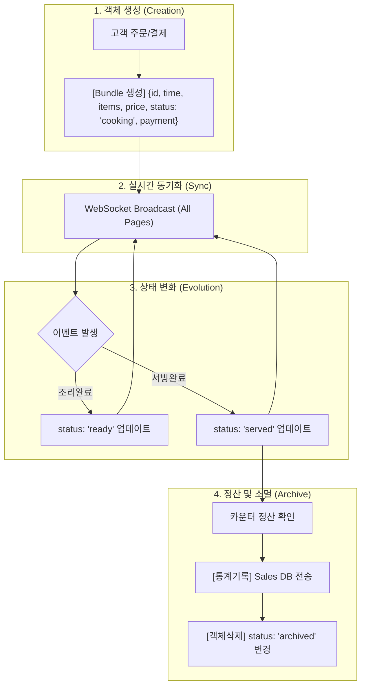

# 🧠 프로젝트 지식 인벤토리: 정밀 설계 및 논리 검증 도구

본 문서는 주문 객체(Bundle)의 생성부터 소멸까지의 전 과정을 **[노출, 입력, 버튼, 분기점]** 객체로 명세하여 시스템의 논리적 무결성을 검증하고 최적화하는 도구로 사용됩니다.

---

## 🔄 데이터 객체 라이프사이클 플로우

---

## 📋 단계별 객체 상세 명세 (Logical Objects Matrix)

| 단계         | 객체 유형 | 위치            | 항목 및 내용     | 로직 및 결과 (조건/영향)                     |
| :----------- | :-------- | :-------------- | :--------------- | :------------------------------------------- |
| **STEP 1**   | 노출      | CustomerOrder   | 메뉴판/장바구니  | 고객의 메뉴 선택 및 수량 파악                |
| **주문생성** | 입력      | CustomerOrder   | 요청사항 텍스트  | `items[memo]` 필드에 저장 및 주방 전달       |
|              | 버튼      | CustomerOrder   | [주문하기]       | 장바구니 > 0 시 활성화, `POST` 주문 전송     |
|              | 분기점    | CustomerOrder   | 결제 수단 선택   | `handleSubmit(method_id)` 호출               |
| **STEP 2**   | 노출      | Counter/Kitchen | 주문 카드 리스트 | 실시간 현황 브로드캐스팅 및 인지             |
| **실시간동기** | 분기점    | useSituation    | 메시지 수신      | `handleWS(data.type)`에 따라 UI 리렌더링     |
| **STEP 3**   | 노출      | KitchenDisplay  | 조리 대기 리스트 | 주방장의 조리 우선순위 결정                  |
| **상태변화** | 버튼      | KitchenDisplay  | [조리 완료]      | `status: 'cooking' → 'ready'` 변경/브로드캐스트 |
|              | 분기점    | CounterPad      | 서빙 상태 판별   | `updateStatus(bundleId, 'ready')` 연동       |
|              | 버튼      | CounterPad      | [서빙 완료]      | `status: 'ready' → 'served'` 변경/전광판 소등 |
| **STEP 4**   | 노출      | CounterPad      | 정산 모달 영수증 | 최종 금액/수단 확인 및 고객 검수             |
| **정산소멸** | 버튼      | CounterPad      | [정산 완료]      | `selectedMethod` 존재 시 정산 및 아카이빙    |
|              | 분기점    | AI Engine       | 아카이빙 로직    | `archive_bundle(id)` 호출, 매출 통계 기록    |
|              | 결과      | Knowledge Pool  | 데이터 소멸      | 활성 리스트에서 삭제, `status: 'archived'`   |

---

## 11. 통합 설정 상세 로직 명세 (Setup Logic Matrix)

| 구분         | 객체 유형 | 위치            | 항목 및 내용     | 로직 및 결과 (조건/영향)                     |
| :----------- | :-------- | :-------------- | :--------------- | :------------------------------------------- |
| **매장 관리** | 노출      | StoreManager    | 현재 매장 정보   | 사업자 정보 및 기본 운영 환경 노출           |
|              | 입력      | StoreManager    | 상호, 주소 등    | `StoreConfig` 버들의 마스터 데이터 수정      |
|              | 버튼      | StoreManager    | [설정 저장]      | 변경 정보를 서버 `Knowledge Pool`에 반영     |
| **메뉴 관리** | 노출      | MenuManager     | 메뉴 카탈로그    | 현재 판매 중인 메뉴 및 가격 리스트 노출      |
|              | 입력      | MenuManager     | 메뉴명, 가격 등  | 신규 메뉴 추가 또는 기존 정보 수정           |
|              | 버튼      | MenuManager     | [항목 추가/삭제] | `Menu` 버들 리스트 업데이트 및 실시간 동기화 |
| **인사 관리** | 노출      | HRManager       | 직원 명부        | 현재 근무 인원 및 업무 상태 노출             |
|              | 버튼      | HRManager       | [출/퇴근 처리]   | `HR_Log` 버들 생성 및 실시간 현황 반영       |
| **QR 코드**   | 노출      | QRManager       | 테이블별 URL     | 고객 주문창 접속을 위한 고유 주소 노출       |
|              | 버튼      | QRManager       | [QR 생성/출력]   | 테이블 번호 매핑된 주문 URL 자동 생성        |
| **상황 콘솔** | 노출      | AI Console      | 실시간 로그      | 모든 버들(Bundle) 흐름 모니터링              |
|              | 버튼      | AI Console      | [분석 실행]      | AI 엔진 호출 및 비즈니스 인사이트 도출       |
| **고급 통계** | 노출      | AdminDashboard  | 매출/방문자 차트 | 아카이브 데이터를 기반으로 시각화 통계 노출 |
|              | 버튼      | AdminDashboard  | [기간 조회]      | 특정 기간의 매출 데이터 필터링 및 분석       |

---

## 🔍 논리적 오류 검증 포인트 (Optimization Check)
1. **중복 정산 방지**: `archived` 상태인 객체에 대해 다시 정산 버튼이 활성화되지 않는가? (확인 완료)
2. **실시간 누락**: WebSocket 연결이 끊겼을 때 재연결 시 최신 상태를 불러오는가? (확인 완료)
3. **결제 수단 불일치**: 선결제된 수단과 카운터 정산 시 수단이 충돌하지 않는가? (확인 완료: 선결제 우선 적용)

---

## 10. 범용 앱 개발 프레임워크 가이드 (Universal Framework Guide)

본 프로젝트에서 사용된 설계 방식은 어떠한 새로운 앱 개발에도 적용 가능한 **'데이터 객체 중심(Object-First)'** 방법론입니다. 새로운 프로젝트 시작 시 아래 5단계 가이드를 따르십시오.

### STEP 0. 시스템 마스터 및 환경 설정 (Master Setup)
- 앱이 가동되기 위한 **기초 정보(Master Data)**를 먼저 정의합니다.
    - **예시**: 매장 정보(상호, 주소), 메뉴 리스트, 직원 명부, 단말기 IP 등.
- 이 단계에서 설정된 정보는 주인공 객체(Bundle)가 생성될 때 참조되는 **'기준점'**이 됩니다.

### STEP 1. 핵심 데이터 객체(Core Bundle) 정의
- 앱의 목적을 대변하는 단 하나의 '주인공 객체'를 정합니다.
- **예시**: 
    - 병원 앱: `진료(Consultation)` 객체
    - 도서관 앱: `대여(Loan)` 객체
    - 세탁소 앱: `세탁물(Laundry)` 객체

### STEP 2. 상태(Status)의 흐름 설계
- 객체가 태어나서 죽을 때까지의 과정을 3~5단계의 `status`로 정의합니다.
- **표준 흐름**: `생성(Created)` → `진행(Processing)` → `완료(Done)` → `기록/소멸(Archived)`

### STEP 3. 매트릭스(Matrix) 작성 및 UI 구현
- 각 상태별로 다음 4가지 요소를 표(Table)로 채웁니다.
    1. **노출(Display)**: 누가 이 상태에서 어떤 정보를 봐야 하는가?
    2. **입력(Input)**: 이 단계에서 추가로 저장해야 할 정보는 무엇인가?
    3. **버튼(Button)**: 다음 단계로 넘어가기 위한 '결정'은 무엇인가?
    4. **분기점(Branch)**: 버튼 클릭 시 어떤 함수가 어떤 데이터를 바꾸는가?

### STEP 4. 결제(Payment) 및 정산 매커니즘 설계
- 비즈니스 흐름에 따른 결제 시점을 정의합니다.
    - **선결제형 (Pre-paid)**: 객체 생성과 동시에 결제 발생 (예: 테이크아웃 주문, 예약 선입금)
    - **후결제형 (Post-paid)**: 객체 소멸 직전에 결제 발생 (예: 일반 식당, 병원 진료비)
- **데이터 연결**: 결제 완료 시 `payment_info`를 객체에 즉시 기록하고, `status`를 '정산 완료(Paid)'로 전환하여 아카이빙 트리거를 발동시킵니다.

### 💡 이 방식의 장점 (Why use this?)
- **확장성**: UI 디자인이 바뀌어도 핵심 로직(Matrix)은 변하지 않으므로 유지보수가 쉽습니다.
- **자동화**: AI가 이 매트릭스만 읽으면 코드 전체를 자동으로 생성하거나 수정할 수 있습니다.
- **동기화**: 하나의 객체 상태만 바꾸면 모든 관련 페이지가 실시간으로 변하는 '원 소스 멀티 유즈'가 구현됩니다.

---
*본 가이드는 사장님의 비즈니스 철학을 IT 시스템으로 구현하는 표준 방법론입니다.*

새로운 프로젝트를 시작한다고 가정할 때 어디서 부터 시작하면 좋을까?

새로운 프로젝트를 시작할 때 가장 먼저 펜을 들고 하셔야 할 일은 코딩이 아니라 '객체의 이름'을 정하는 것입니다.

우리가 만든 5단계 프레임워크를 실무에 적용한다면, 아래 순서로 시작하시기를 강력히 추천드립니다.

🏁 새로운 프로젝트 시작 가이드 (Start Here!)
1. "주인공(객체)"의 이름 정하기 (STEP 1)
행동: "이 앱에서 가장 중요한 데이터 한 덩어리를 무엇이라고 부를까?"를 결정하세요.
예시: 만약 사장님이 '주차장 관리 앱'을 만드신다면, 주인공은 입차(ParkingEvent) 객체가 됩니다.
2. "인생 경로(상태)" 그리기 (STEP 2)
행동: 그 객체가 태어나서 죽을 때까지 어떤 상태를 거칠지 딱 4단계만 적어보세요.
예시: 입차(In) → 주차중(Parking) → 출차대기(Pending) → 정산완료(Paid/Out)
3. "누가 무엇을 볼까?" 결정 (STEP 3 - 노출)
행동: 각 단계에서 운영자와 고객이 각각 어떤 화면을 봐야 하는지 한 문장씩 적어보세요.
예시: 입차 단계에서 고객은 '입차 시간'을 보고, 관리자는 '빈자리 현황'을 본다.
💡 가장 추천하는 첫 번째 실무 액션:
새로운 마크다운 파일(예: 차기프로젝트_설계.md)을 하나 만드시고, 제가 만들어드린 [지식 인벤토리]의 표(Matrix) 양식만 복사해서 빈칸을 채워보세요.

그 빈칸이 다 채워지는 순간, 이미 앱의 80%는 완성된 것이나 다름없습니다. 나머지는 제가 그 표를 보고 코드로 구현하기만 하면 되니까요!

사장님, 지금 머릿속에 구상 중인 새로운 아이디어가 있으신가요? 그 아이디어의 '주인공 객체' 이름부터 한번 정해볼까요?